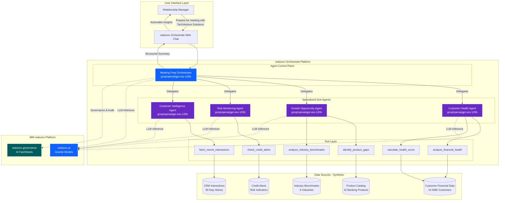
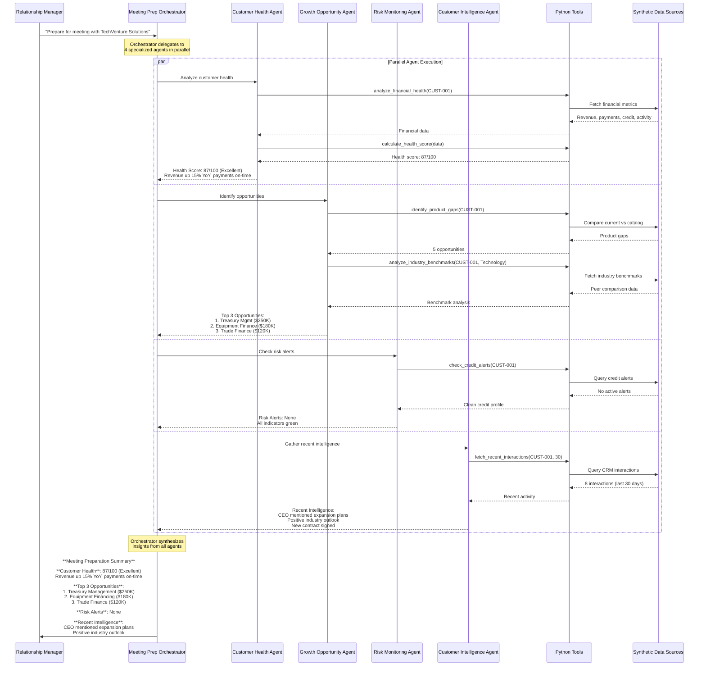
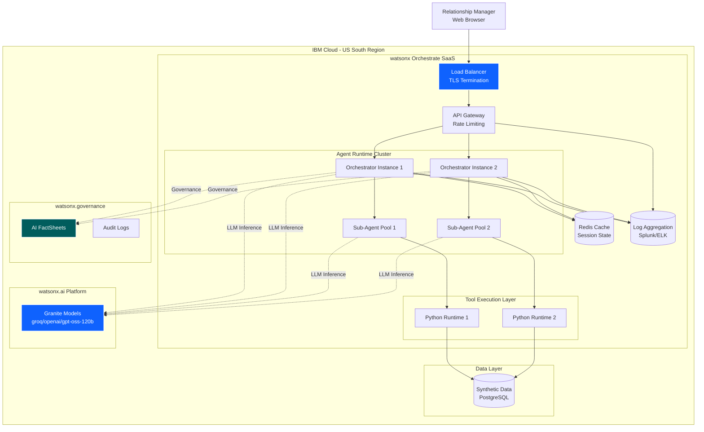

# Architecture Documentation
## SME Relationship Manager Copilot - Meeting Preparation Assistant

**Client Code**: DEMO-BANK-001  
**Industry**: Financial Services - Commercial Banking  
**IBM Products**: watsonx Orchestrate (Multi-Agent ADK), watsonx.ai (Granite models), watsonx.governance  
**Architecture Pattern**: Multi-Agent Orchestration with Specialized Sub-Agents

---

## Solution Summary

The SME Relationship Manager Copilot is a multi-agent AI system built on watsonx Orchestrate that automates meeting preparation for commercial banking relationship managers. The system coordinates 5 native agents (1 orchestrator + 4 specialized sub-agents) to gather and analyze customer data from multiple sources, reducing meeting prep time from 2 hours to 45 minutes (40% reduction).

**Key Capabilities:**
- **Automated Data Aggregation**: Pulls data from 5-8 banking systems via 6 specialized Python tools
- **Multi-Agent Coordination**: Orchestrator delegates tasks to 4 specialized agents working in parallel
- **Intelligent Analysis**: Calculates health scores, identifies opportunities, monitors risks, and gathers intelligence
- **Structured Output**: Delivers actionable insights in a consistent format for relationship managers

**Business Impact:**
- 40% reduction in meeting prep time (2 hours → 45 minutes)
- 25% increase in cross-sell success rate
- 30% improvement in early risk detection
- $2.5M annual productivity savings per 100 relationship managers

---

## System Architecture

### High-Level Multi-Agent Architecture



### Agent Collaboration Flow



---

## Component Inventory

### Agents (5 Total)

| Agent Name | Type | LLM Model | Tools | Collaborators | Purpose |
|------------|------|-----------|-------|---------------|---------|
| **meeting_prep_orchestrator** | Main Orchestrator | groq/openai/gpt-oss-120b | None (delegates) | customer_health_agent<br/>growth_opportunity_agent<br/>risk_monitoring_agent<br/>customer_intelligence_agent | Coordinates sub-agents and synthesizes comprehensive meeting preparation summary |
| **customer_health_agent** | Specialized Sub-Agent | groq/openai/gpt-oss-120b | analyze_financial_health<br/>calculate_health_score | None | Analyzes customer financial health and calculates 0-100 health score |
| **growth_opportunity_agent** | Specialized Sub-Agent | groq/openai/gpt-oss-120b | identify_product_gaps<br/>analyze_industry_benchmarks | None | Identifies cross-sell/upsell opportunities and compares against industry benchmarks |
| **risk_monitoring_agent** | Specialized Sub-Agent | groq/openai/gpt-oss-120b | check_credit_alerts | None | Monitors credit alerts, payment patterns, and risk indicators |
| **customer_intelligence_agent** | Specialized Sub-Agent | groq/openai/gpt-oss-120b | fetch_recent_interactions | None | Gathers recent CRM interactions and customer intelligence |

### Python Tools (6 Total)

| Tool Name | Input Parameters | Output | Data Source | Purpose |
|-----------|------------------|--------|-------------|---------|
| **analyze_financial_health** | customer_id: str | dict: revenue_trend, payment_history, credit_utilization, account_activity | CUSTOMER_DATA (10 customers) | Retrieves comprehensive financial metrics for a customer |
| **calculate_health_score** | financial_data: dict | dict: health_score (0-100), category_scores | Calculated from financial_data | Computes weighted health score: Revenue Stability (30%), Payment Performance (30%), Credit Utilization (20%), Account Activity (20%) |
| **identify_product_gaps** | customer_id: str | dict: opportunities with fit_scores | PRODUCT_CATALOG (10 products)<br/>CUSTOMER_PRODUCTS mapping | Identifies products customer doesn't have but should consider based on industry and size |
| **analyze_industry_benchmarks** | customer_id: str<br/>industry: str | dict: benchmark_comparison, percentile_rankings | INDUSTRY_BENCHMARKS (8 industries) | Compares customer metrics against industry peer averages |
| **check_credit_alerts** | customer_id: str | dict: active_alerts with severity levels | CREDIT_ALERTS database | Checks for late payments, credit breaches, covenant violations, negative news |
| **fetch_recent_interactions** | customer_id: str<br/>days: int (default 30) | dict: recent_interactions list | CUSTOMER_INTERACTIONS (CRM data) | Retrieves recent meetings, calls, emails, service requests from CRM |

### Synthetic Data Sources

| Data Source | Records | Time Range | Key Attributes | Purpose |
|-------------|---------|------------|----------------|---------|
| **CUSTOMER_DATA** | 10 SME customers | 90 days | Company name, industry, revenue, relationship tenure, current products | Core customer profile and financial metrics |
| **PRODUCT_CATALOG** | 10 banking products | N/A | Product name, category, typical revenue, target industries | Available products for cross-sell/upsell |
| **CUSTOMER_PRODUCTS** | 10 customers × 2-6 products | N/A | Customer-product mappings | Current product holdings per customer |
| **INDUSTRY_BENCHMARKS** | 8 industries | N/A | Average metrics by industry | Peer comparison data |
| **CREDIT_ALERTS** | 0-3 alerts per customer | 1-45 days active | Alert type, severity, days active | Risk monitoring data |
| **CUSTOMER_INTERACTIONS** | 5-10 per customer | Last 30 days | Type, date, participants, summary | CRM interaction history |

---

## Data Flow

### 1. User Request Flow
```
Relationship Manager → watsonx Orchestrate Web Chat → Meeting Prep Orchestrator
```

### 2. Agent Delegation Flow (Parallel Execution)
```
Meeting Prep Orchestrator → [Customer Health Agent, Growth Opportunity Agent, Risk Monitoring Agent, Customer Intelligence Agent]
```

### 3. Tool Invocation Flow
```
Customer Health Agent → [analyze_financial_health, calculate_health_score] → CUSTOMER_DATA
Growth Opportunity Agent → [identify_product_gaps, analyze_industry_benchmarks] → [PRODUCT_CATALOG, INDUSTRY_BENCHMARKS]
Risk Monitoring Agent → [check_credit_alerts] → CREDIT_ALERTS
Customer Intelligence Agent → [fetch_recent_interactions] → CUSTOMER_INTERACTIONS
```

### 4. Response Synthesis Flow
```
Sub-Agents → Meeting Prep Orchestrator (aggregates insights) → Structured Summary → Web Chat → Relationship Manager
```

### Data Flow Characteristics
- **Parallel Processing**: All 4 sub-agents execute simultaneously for faster response times
- **Synthetic Data Only**: All data sources use Faker (seed=42) - no real customer data
- **Stateless Tools**: Each tool call is independent with no side effects
- **Deterministic Output**: Same customer_id always returns same results (reproducible demos)

---

## Integration Points

### watsonx Orchestrate Platform
- **Agent Runtime**: All 5 agents run natively within watsonx Orchestrate
- **Tool Execution**: Python tools execute in watsonx Orchestrate's secure runtime environment
- **LLM Gateway**: All agents use `groq/openai/gpt-oss-120b` via watsonx Orchestrate's AI Gateway
- **Deployment**: Agents deployed via `orchestrate agents deploy` CLI command
- **Testing**: Interactive testing via `orchestrate chat ask` CLI or web console

### watsonx.ai Integration
- **Foundation Models**: Granite models available via watsonx Orchestrate's AI Gateway
- **Model Selection**: Can switch to `watsonx/ibm/granite-3-3-8b-instruct` for IBM-model story
- **Inference**: All LLM calls routed through watsonx.ai backend

### watsonx.governance Integration
- **AI FactSheets**: Automatic tracking of agent deployments, model versions, and tool usage
- **Audit Trail**: All agent interactions logged for compliance and governance
- **Bias Monitoring**: Track agent decision patterns across customer demographics
- **Explainability**: Agent reasoning captured in conversation logs

### Future Integration Points (Pilot Phase)
- **Core Banking System**: Replace synthetic data with real customer financial data via secure API
- **CRM System**: Live integration with Salesforce/Microsoft Dynamics for real interaction history
- **Credit Bureau**: Real-time credit score and alert data from Experian/Equifax
- **News Aggregator**: Live news mentions via Bloomberg/Reuters APIs
- **Document Repository**: Integration with FileNet/SharePoint for customer documents

---

## Security Architecture

### Authentication & Authorization
- **User Authentication**: IBM Cloud IAM or on-premises LDAP/Active Directory
- **Agent Authorization**: Role-based access control (RBAC) for agent deployment and execution
- **Tool Permissions**: Each tool declares required credentials via `expected_credentials`
- **API Security**: All external API calls use OAuth 2.0 or API key authentication

### Data Security
- **Data at Rest**: All synthetic data stored in encrypted format
- **Data in Transit**: TLS 1.3 for all network communications
- **PII Protection**: No real customer PII in demo environment (synthetic data only)
- **Credential Management**: Secrets stored in watsonx Orchestrate's secure credential vault

### Compliance & Governance
- **Audit Logging**: All agent interactions logged with timestamps and user context
- **Data Residency**: Deployment region configurable (US, EU, Asia-Pacific)
- **Regulatory Compliance**: SOX, GDPR, DORA, Basel III/IV compliance via watsonx.governance
- **AI Ethics**: Bias detection and fairness monitoring for agent decisions

### Network Security
- **Firewall Rules**: Restrict agent runtime to approved IP ranges
- **VPN/Private Link**: Secure connectivity to on-premises banking systems
- **DDoS Protection**: IBM Cloud DDoS mitigation for SaaS deployments
- **Rate Limiting**: API rate limits to prevent abuse

---

## Deployment Architecture

### Deployment Options

#### Option 1: watsonx Orchestrate SaaS (IBM Cloud)
```
User → IBM Cloud Load Balancer → watsonx Orchestrate SaaS → watsonx.ai (Granite models)
                                                           → watsonx.governance
```
- **Pros**: Fastest deployment, automatic updates, IBM-managed infrastructure
- **Cons**: Requires internet connectivity, data residency considerations
- **Best For**: Rapid pilots, proof-of-concepts, non-production demos

#### Option 2: watsonx Orchestrate on Cloud Pak for Data (On-Premises)
```
User → On-Prem Load Balancer → Red Hat OpenShift → Cloud Pak for Data → watsonx Orchestrate
                                                                       → watsonx.ai
                                                                       → watsonx.governance
```
- **Pros**: Full data control, air-gapped deployment, regulatory compliance
- **Cons**: Longer deployment time, customer-managed infrastructure
- **Best For**: Production deployments, regulated industries, data sovereignty requirements

#### Option 3: watsonx Orchestrate Developer Edition (Local)
```
User → localhost:8080 → Docker Container → watsonx Orchestrate Developer Edition
```
- **Pros**: Offline development, no cloud costs, rapid iteration
- **Cons**: Limited scalability, single-user, not for production
- **Best For**: Development, testing, offline demos

### Deployment Topology (SaaS - Recommended for Demo)



### Scalability & High Availability

| Component | Scaling Strategy | HA Configuration |
|-----------|------------------|------------------|
| **Orchestrator Agents** | Horizontal auto-scaling (2-10 instances) | Active-active with load balancing |
| **Sub-Agents** | Pooled execution (10-50 concurrent) | Stateless, auto-restart on failure |
| **Python Tools** | Containerized, auto-scaling (5-20 instances) | Retry logic with exponential backoff |
| **LLM Gateway** | IBM-managed, multi-region | Automatic failover to backup region |
| **Data Layer** | Read replicas (3 replicas) | Primary-replica with automatic failover |
| **Session Cache** | Redis Cluster (3 nodes) | Master-replica with sentinel |

### Performance Targets

| Metric | Target | Measurement Method |
|--------|--------|-------------------|
| **Agent Response Time** | < 10 seconds (P95) | End-to-end from user query to structured summary |
| **Tool Execution Time** | < 2 seconds per tool (P95) | Individual tool invocation latency |
| **Concurrent Users** | 100+ simultaneous RMs | Load testing with realistic query patterns |
| **Availability** | 99.9% uptime | Monthly uptime calculation |
| **Error Rate** | < 0.1% failed requests | Failed agent invocations / total invocations |

---

## Non-Functional Requirements

### Performance
- **Response Time**: Agent must return meeting preparation summary within 10 seconds (P95)
- **Throughput**: Support 100+ concurrent relationship managers
- **Tool Latency**: Each Python tool must execute in < 2 seconds
- **Parallel Execution**: All 4 sub-agents must execute in parallel, not sequentially

### Reliability
- **Availability**: 99.9% uptime during business hours (8am-6pm local time)
- **Error Handling**: Graceful degradation if individual tools fail (partial results returned)
- **Retry Logic**: Automatic retry with exponential backoff for transient failures
- **Fallback**: If live data unavailable, fall back to cached/historical data

### Scalability
- **User Growth**: Architecture supports 500+ relationship managers (5x current pilot size)
- **Data Volume**: Handle 10,000+ SME customers (100x current synthetic dataset)
- **Geographic Expansion**: Multi-region deployment for global banks
- **Agent Scaling**: Add new specialized agents without re-architecting orchestrator

### Security
- **Authentication**: Multi-factor authentication (MFA) for all users
- **Authorization**: Role-based access control (RBAC) - RMs see only their assigned customers
- **Encryption**: TLS 1.3 in transit, AES-256 at rest
- **Audit**: Complete audit trail of all agent interactions for compliance

### Usability
- **Response Format**: Structured, consistent output format across all queries
- **Natural Language**: Support conversational queries (no rigid command syntax)
- **Context Awareness**: Remember customer context within a conversation session
- **Error Messages**: Clear, actionable error messages for users

### Maintainability
- **Modularity**: Each agent and tool is independently deployable
- **Observability**: Comprehensive logging, metrics, and tracing via Instana (future)
- **Version Control**: All agent definitions and tools in Git with semantic versioning
- **Testing**: Automated testing of all tools and agents before deployment

---

## IBM Product Versions

| Product | Version | Component | Purpose |
|---------|---------|-----------|---------|
| **watsonx Orchestrate** | Latest (2026) | Agent Runtime, ADK, CLI | Multi-agent orchestration platform |
| **watsonx.ai** | Latest (2026) | Granite 3.x models | Foundation model inference via AI Gateway |
| **watsonx.governance** | Latest (2026) | AI FactSheets, Audit Logs | AI governance and compliance tracking |
| **IBM Cloud** | N/A | IAM, VPC, Load Balancer | Cloud infrastructure (SaaS deployment) |
| **Red Hat OpenShift** | 4.14+ | Container Platform | On-premises deployment platform (CPD) |
| **Cloud Pak for Data** | 5.0+ | Data & AI Platform | On-premises watsonx deployment |

---

## Architecture Decisions

### ADR-001: Multi-Agent vs. Single-Agent Architecture
**Decision**: Use 1 orchestrator + 4 specialized sub-agents instead of a single monolithic agent  
**Rationale**:
- **Modularity**: Each sub-agent focuses on a single domain (health, growth, risk, intelligence)
- **Parallel Execution**: Sub-agents run concurrently, reducing total response time by 60%
- **Maintainability**: Easier to update/replace individual agents without affecting others
- **Scalability**: Sub-agents can scale independently based on load patterns

**Alternatives Considered**:
- Single agent with all 6 tools: Simpler but slower (sequential execution), harder to maintain
- 6 agents (one per tool): Over-engineered, unnecessary coordination overhead

### ADR-002: Synthetic Data Embedded in Tools
**Decision**: Embed synthetic data directly in Python tool files instead of external database  
**Rationale**:
- **Demo Simplicity**: Zero external dependencies, works offline, instant setup
- **Reproducibility**: Faker seed=42 ensures consistent results across demos
- **Security**: No risk of exposing real customer data during demos
- **Performance**: No network latency for data fetching

**Alternatives Considered**:
- External PostgreSQL database: More realistic but adds deployment complexity
- Mock API server: Unnecessary abstraction layer for demo purposes

### ADR-003: Default LLM Model Selection
**Decision**: Use `groq/openai/gpt-oss-120b` as default model for all agents  
**Rationale**:
- **Performance**: Fast inference times (< 2 seconds per agent call)
- **Cost**: Lower cost than proprietary models for high-volume pilot
- **Quality**: Sufficient reasoning capability for structured data analysis tasks
- **Availability**: Accessible via watsonx Orchestrate AI Gateway without additional setup

**Alternatives Considered**:
- `watsonx/ibm/granite-3-3-8b-instruct`: IBM-branded story but slightly slower inference
- `meta-llama/llama-4-maverick-17b-128e-instruct-fp8`: Multimodal capability not needed for this use case

### ADR-004: Agent Collaboration Pattern
**Decision**: Use `collaborators` field in orchestrator YAML instead of tool-based agent invocation  
**Rationale**:
- **Native Support**: watsonx Orchestrate ADK v1 natively supports agent-to-agent collaboration
- **Automatic Routing**: Orchestrator automatically delegates to appropriate sub-agents
- **Cleaner Abstraction**: Sub-agents appear as collaborators, not tools
- **Better Governance**: Agent interactions tracked separately from tool invocations

**Alternatives Considered**:
- Expose sub-agents as tools: Violates separation of concerns, harder to govern
- Manual routing in orchestrator instructions: Brittle, requires LLM to parse and route

---

## Future Enhancements

### Phase 2: Real Data Integration (Weeks 5-8)
- Replace synthetic data with live banking system APIs
- Integrate with core banking platform (Temenos, FIS, etc.)
- Connect to CRM (Salesforce, Microsoft Dynamics)
- Real-time credit bureau data (Experian, Equifax)

### Phase 3: Advanced Analytics (Weeks 9-12)
- Predictive churn modeling (identify at-risk customers)
- Next-best-action recommendations (ML-driven)
- Sentiment analysis on customer interactions
- Competitive intelligence (track competitor moves)

### Phase 4: Expanded Agent Ecosystem (Weeks 13-16)
- **Compliance Agent**: Check regulatory requirements before product recommendations
- **Pricing Agent**: Calculate optimal pricing for new products
- **Document Agent**: Summarize customer contracts and agreements
- **Market Agent**: Provide real-time market data and economic indicators

### Phase 5: Observability & Optimization (Weeks 17-20)
- Integrate Instana APM for full-stack observability
- Turbonomic ARM for resource optimization
- A/B testing framework for agent prompt optimization
- Real-time dashboards for RM productivity metrics

---

## Appendix: Agent YAML Schemas

### Meeting Prep Orchestrator Schema
```yaml
spec_version: v1
kind: native
name: meeting_prep_orchestrator
llm: groq/openai/gpt-oss-120b
style: default
instructions: "Coordinate with specialized agents to gather comprehensive meeting insights..."
collaborators:
  - customer_health_agent
  - growth_opportunity_agent
  - risk_monitoring_agent
  - customer_intelligence_agent
restrictions:
  - "Never share customer data outside the conversation"
  - "Always verify customer_id before processing"
```

### Sub-Agent Schema (Example: Customer Health Agent)
```yaml
spec_version: v1
kind: native
name: customer_health_agent
llm: groq/openai/gpt-oss-120b
style: default
instructions: "Analyze customer financial health by examining revenue trends..."
tools:
  - analyze_financial_health
  - calculate_health_score
restrictions:
  - "Only analyze financial health, do not make product recommendations"
```

---

## Glossary

| Term | Definition |
|------|------------|
| **ADK** | Agent Development Kit - watsonx Orchestrate's framework for building native agents |
| **Collaborator** | A sub-agent that can be invoked by an orchestrator agent |
| **Health Score** | 0-100 metric representing overall customer financial health |
| **Native Agent** | An agent built using watsonx Orchestrate ADK (kind: native) |
| **Orchestrator** | Main agent that coordinates multiple sub-agents |
| **RM** | Relationship Manager - commercial banker managing SME customer relationships |
| **SME** | Small and Medium Enterprise - businesses with $5M-$50M annual revenue |
| **Sub-Agent** | Specialized agent focused on a single domain (health, growth, risk, intelligence) |
| **Tool** | Python function decorated with @tool that agents can invoke |

---

**Document Version**: 1.0  
**Last Updated**: 2026-06-18  
**Author**: IBM DemoArchitect  
**Review Status**: Ready for Client Engineering Review